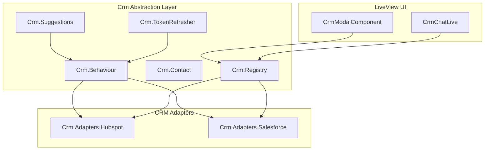

# Salesforce Integration, CRM Abstraction, and Chat Interface (TDD)

## TDD Approach

Every phase follows **Red-Green-Refactor**:

1. **RED**: Write tests that define the expected behavior (they fail because implementation doesn't exist yet)
2. **GREEN**: Write the minimum implementation to make all tests pass
3. **REFACTOR**: Clean up while keeping tests green

For Elixir, "RED" means: create the test file, create minimal stub modules/structs (just enough to compile), then run tests to confirm they fail for the right reasons.

## Core Design Principle

Every piece of CRM logic is written **once** in a provider-agnostic way. Adding a future CRM requires only an adapter, field mapping, Ueberauth strategy, and one line in the registry.

## Architecture




---

## Phase 1: Test Infrastructure

Set up the foundation that all subsequent test phases depend on.

### 1a. Update `test/test_helper.exs`

Add a single `CrmApiMock` that mocks `Crm.Behaviour` (replaces HubSpot-specific mock eventually, but keep old mock for now so existing tests don't break):

```elixir
Mox.defmock(SocialScribe.CrmApiMock, for: SocialScribe.Crm.Behaviour)
Application.put_env(:social_scribe, :crm_api, SocialScribe.CrmApiMock)
```

### 1b. Add fixtures to `test/support/fixtures/accounts_fixtures.ex`

```elixir
def salesforce_credential_fixture(attrs \\ %{}) do
  # provider: "salesforce", includes instance_url
end
```

### 1c. Add chat fixtures to `test/support/fixtures/chat_fixtures.ex`

```elixir
def chat_conversation_fixture(attrs \\ %{}) do ...
def chat_message_fixture(attrs \\ %{}) do ...
```

---

## Phase 2: CRM Abstraction Layer

### Phase 2a: RED -- Write Failing Tests

Write all these test files first. Create minimal stub modules (empty `defmodule` with struct definitions) so the tests compile but fail.

#### `test/social_scribe/crm/contact_test.exs`

Tests for the normalized contact struct:

```elixir
describe "new/1" do
  test "creates contact from map with canonical field names"
  test "computes display_name from first_name + last_name"
  test "falls back to email for display_name when name is empty"
  test "stores provider and provider_data"
  test "get_field/2 returns value for canonical field name"
  test "get_field/2 returns nil for unknown field"
end
```

#### `test/social_scribe/crm/registry_test.exs`

```elixir
describe "adapter_for/1" do
  test "returns HubSpot adapter for 'hubspot'"
  test "returns Salesforce adapter for 'salesforce'"
  test "returns error for unknown provider"
end

describe "crm_providers/0" do
  test "returns list of all registered CRM provider strings"
end

describe "provider_label/1" do
  test "returns 'HubSpot' for 'hubspot'"
  test "returns 'Salesforce' for 'salesforce'"
end
```

#### `test/social_scribe/crm/token_refresher_test.exs`

```elixir
describe "ensure_valid_token/2" do
  test "returns credential unchanged when token expires in more than 5 minutes"
  test "calls adapter.refresh_token when token expires within 5 minutes"
  test "calls adapter.refresh_token when token is already expired"
  test "returns error when refresh fails"
end
```

#### `test/social_scribe/crm/suggestions_test.exs`

```elixir
describe "generate_from_meeting/1" do
  test "returns suggestions with canonical field names from AI"
  test "returns empty list when AI finds no suggestions"
  test "returns error when AI call fails"
end

describe "merge_with_contact/2" do
  test "sets current_value from contact for each suggestion"
  test "filters out suggestions where new_value matches current_value"
  test "marks all remaining suggestions with apply: true"
  test "handles empty suggestions list"
  test "handles contact with nil fields"
end

describe "field_label/1" do
  test "returns human-readable label for canonical field names"
  test "returns the field name itself for unknown fields"
end
```

#### `test/social_scribe/crm/adapters/hubspot_test.exs`

```elixir
describe "field_mappings/0" do
  test "returns mappings for all standard contact fields"
  test "each mapping has canonical, provider, and label keys"
end

describe "to_contact/1" do
  test "converts HubSpot API response to Crm.Contact struct"
  test "maps HubSpot field names to canonical names"
  test "sets provider to 'hubspot'"
  test "preserves raw response in provider_data"
end

describe "to_provider_fields/1" do
  test "converts canonical field map to HubSpot field names"
end

describe "provider_name/0" do
  test "returns 'hubspot'"
end
```

#### `test/social_scribe/crm/adapters/salesforce_test.exs`

```elixir
describe "field_mappings/0" do
  test "returns mappings for all standard contact fields"
  test "maps canonical names to Salesforce PascalCase names"
end

describe "to_contact/1" do
  test "converts Salesforce API response to Crm.Contact struct"
  test "maps Salesforce PascalCase fields to canonical names"
  test "sets provider to 'salesforce'"
end

describe "to_provider_fields/1" do
  test "converts canonical field map to Salesforce PascalCase names"
end

describe "provider_name/0" do
  test "returns 'salesforce'"
end
```

#### `test/social_scribe/workers/crm_token_refresher_test.exs`

```elixir
describe "perform/1" do
  test "refreshes tokens expiring within 10 minutes for all CRM providers"
  test "does nothing when no tokens are expiring"
  test "logs errors but returns :ok when individual refreshes fail"
end
```

### Phase 2b: GREEN -- Implement

Create all modules to make tests pass:

- `lib/social_scribe/crm/behaviour.ex` -- Behaviour definition with callbacks
- `lib/social_scribe/crm/contact.ex` -- Normalized struct with `new/1`, `get_field/2`, `display_name/1`
- `lib/social_scribe/crm/registry.ex` -- Provider-to-adapter mapping
- `lib/social_scribe/crm/token_refresher.ex` -- Generic `ensure_valid_token/2`, `with_token_refresh/3`
- `lib/social_scribe/crm/suggestions.ex` -- AI suggestion generation using canonical fields, `merge_with_contact/2`
- `lib/social_scribe/crm/adapters/hubspot.ex` -- Implements `Crm.Behaviour`, wraps existing `HubspotApi` logic
- `lib/social_scribe/crm/adapters/hubspot_fields.ex` -- Canonical <-> HubSpot field mapping
- `lib/social_scribe/crm/adapters/salesforce.ex` -- Implements `Crm.Behaviour` (stub initially, full in Phase 3)
- `lib/social_scribe/crm/adapters/salesforce_fields.ex` -- Canonical <-> Salesforce field mapping
- `lib/social_scribe/workers/crm_token_refresher.ex` -- Single Oban worker for all CRMs
- Update `AIContentGeneratorApi` behaviour: replace `generate_hubspot_suggestions` with `generate_crm_suggestions`

---

## Phase 3: Salesforce OAuth

### Phase 3a: RED -- Write Failing Tests

#### `test/social_scribe_web/controllers/salesforce_auth_test.exs`

```elixir
describe "Salesforce OAuth callback" do
  test "creates salesforce credential on successful auth"
  test "stores instance_url from token response"
  test "redirects to settings with success flash"
  test "handles auth failure gracefully"
  test "updates existing credential on re-auth"
end
```

#### `test/social_scribe/accounts_salesforce_test.exs`

```elixir
describe "find_or_create_salesforce_credential/2" do
  test "creates new credential when none exists"
  test "updates existing credential when one exists"
  test "stores instance_url"
end

describe "get_user_crm_credential/2" do
  test "returns credential for hubspot provider"
  test "returns credential for salesforce provider"
  test "returns nil when no credential exists"
end
```

#### `test/social_scribe_web/live/user_settings_salesforce_test.exs`

```elixir
describe "Settings page - Salesforce section" do
  test "shows Connect Salesforce button when no credential"
  test "shows connected Salesforce account when credential exists"
  test "shows Salesforce cloud icon"
end
```

### Phase 3b: GREEN -- Implement

- `lib/ueberauth/strategy/salesforce.ex` + `lib/ueberauth/strategy/salesforce/oauth.ex`
- Migration: `add_instance_url_to_user_credentials`
- Update `UserCredential` schema with `:instance_url` field
- Auth controller `callback/2` for `"salesforce"`
- Accounts context: `find_or_create_salesforce_credential/2`, `get_user_crm_credential/2`
- Config updates: `config.exs`, `runtime.exs`
- Settings page: Salesforce section in template + assign in LiveView

---

## Phase 4: Generic CRM Modal

### Phase 4a: RED -- Write Failing Tests

#### `test/social_scribe_web/live/crm_modal_test.exs`

```elixir
describe "CRM Modal - HubSpot" do
  test "renders modal with 'Update in HubSpot' title"
  test "shows contact search input"
  test "shows 'Update HubSpot' submit button after selecting contact"
  test "modal can be closed by navigating back"
end

describe "CRM Modal - Salesforce" do
  test "renders modal with 'Update in Salesforce' title"
  test "shows contact search input"
  test "shows 'Update Salesforce' submit button after selecting contact"
end

describe "CRM Modal - without credential" do
  test "does not show CRM section when no hubspot credential"
  test "does not show CRM section when no salesforce credential"
end

describe "Meeting show - CRM integration cards" do
  test "shows HubSpot card when hubspot credential exists"
  test "shows Salesforce card when salesforce credential exists"
  test "shows both cards when both credentials exist"
  test "shows no CRM cards when no credentials exist"
end
```

#### `test/social_scribe_web/live/crm_modal_mox_test.exs`

```elixir
describe "CRM Modal with mocked API" do
  test "search_contacts returns results for hubspot"
  test "search_contacts returns results for salesforce"
  test "handles API error gracefully"
  test "selecting contact triggers suggestion generation"
  test "apply_updates calls adapter.update_contact with correct provider"
  test "shows success flash after updating"
end
```

### Phase 4b: GREEN -- Implement

- `lib/social_scribe_web/live/meeting_live/crm_modal_component.ex` -- Generic modal taking `provider` assign
- Refactor `MeetingLive.Show`:
  - Mount: build `crm_credentials` list from all registered CRM providers
  - Three generic `handle_info` clauses: `:crm_search`, `:crm_generate_suggestions`, `:crm_apply_updates`
- Update `show.html.heex`: loop over `crm_credentials`, single modal instance
- Route: add `/meetings/:id/salesforce` alongside `:hubspot`
- Update `ModalComponents` if needed (ensure components accept `Crm.Contact` struct)

---

## Phase 5: "Ask Anything" Chat Interface

### Phase 5a: RED -- Write Failing Tests

#### `test/social_scribe/crm/chat_test.exs`

```elixir
describe "parse_mentions/1" do
  test "extracts single @Name mention"
  test "extracts multiple @Name mentions"
  test "handles @First Last with space"
  test "returns empty list when no mentions"
  test "handles @Name at start, middle, and end of text"
end

describe "create_conversation/1" do
  test "creates a conversation for a user"
  test "sets default title"
end

describe "list_conversations/1" do
  test "returns conversations for user ordered by most recent"
  test "returns empty list when no conversations"
end

describe "add_message/3" do
  test "creates a user message in conversation"
  test "creates an assistant message in conversation"
  test "stores metadata (sources, contacts)"
end

describe "get_conversation_messages/1" do
  test "returns messages ordered by inserted_at"
  test "returns empty list for new conversation"
end

describe "ask/3" do
  test "parses mentions, fetches contact, calls AI, persists messages"
  test "returns AI answer with source references"
  test "handles question with no mentions"
  test "returns error when CRM API fails"
end
```

#### `test/social_scribe_web/live/crm_chat_live_test.exs`

```elixir
describe "Chat page rendering" do
  test "renders 'Ask Anything' header"
  test "renders Chat and History tabs"
  test "renders message input with placeholder"
  test "renders 'Add context' button"
  test "shows AI welcome message"
end

describe "Chat interaction" do
  test "sending a message adds it to the chat"
  test "AI response appears after sending message"
  test "@ mention is highlighted in user message"
  test "@ mention is highlighted in AI response"
  test "chat scrolls to bottom on new message"
end

describe "Chat history" do
  test "History tab shows list of past conversations"
  test "clicking a conversation loads its messages"
  test "new chat button creates fresh conversation"
end

describe "Chat navigation" do
  test "chat is accessible from sidebar"
  test "requires authentication"
end
```

### Phase 5b: GREEN -- Implement

- Migrations: `chat_conversations` and `chat_messages` tables
- Schemas: `Crm.ChatConversation`, `Crm.ChatMessage`
- `lib/social_scribe/crm/chat.ex` -- Context with `parse_mentions/1`, `ask/3`, conversation CRUD
- Add `answer_crm_question/2` to `AIContentGeneratorApi` behaviour + implementation
- `lib/social_scribe_web/live/crm_chat_live.ex` + `.html.heex` -- LiveView matching reference design
- Route: `live "/chat", CrmChatLive` in dashboard
- Sidebar: Add "Ask Anything" link with `hero-chat-bubble-left-right` icon
- JS hooks: `ScrollToBottom`, `ContactMention`

UI specifics (matching reference design with project's indigo primary):

- Header: `text-xl font-bold text-slate-900` with `>>` chevron icon
- Tabs: `text-sm font-medium`, active = indigo-600 border-bottom
- User messages: right-aligned, `bg-gray-100 rounded-2xl px-4 py-3`
- AI messages: left-aligned, no bubble, `text-sm text-slate-700`
- Mentions: `text-indigo-600 font-medium` with small avatar
- Input: bordered container, "Add context" pill, placeholder "Ask anything about your meetings"
- Send: indigo-600 circle with arrow-up icon

---

## Phase 6: Refactor and Cleanup

After all tests are green:

1. Remove old HubSpot-specific files that are now replaced:
  - `lib/social_scribe/hubspot_api_behaviour.ex` (replaced by `crm/behaviour.ex`)
  - `lib/social_scribe/hubspot_api.ex` (replaced by `crm/adapters/hubspot.ex`)
  - `lib/social_scribe/hubspot_suggestions.ex` (replaced by `crm/suggestions.ex`)
  - `lib/social_scribe/hubspot_token_refresher.ex` (replaced by `crm/token_refresher.ex`)
  - `lib/social_scribe/workers/hubspot_token_refresher.ex` (replaced by `workers/crm_token_refresher.ex`)
  - `lib/social_scribe_web/live/meeting_live/hubspot_modal_component.ex` (replaced by `crm_modal_component.ex`)
2. Update existing HubSpot tests to use new module paths
3. Verify all existing tests still pass (no regressions)
4. Remove old Oban cron entry for `HubspotTokenRefresher`, keep single `CrmTokenRefresher`
5. Update `test_helper.exs`: remove old `HubspotApiMock` once all tests migrated

---

## TDD Execution Order Summary

```
Phase 1: Test infrastructure (fixtures, mocks)
    |
Phase 2a: RED  -- CRM abstraction tests (Contact, Registry, TokenRefresher, Suggestions, Adapters)
Phase 2b: GREEN -- Implement CRM abstraction layer
    |
Phase 3a: RED  -- Salesforce OAuth tests (auth callback, credentials, settings)
Phase 3b: GREEN -- Implement Salesforce OAuth
    |
Phase 4a: RED  -- Generic CRM modal tests (render, search, select, apply for both CRMs)
Phase 4b: GREEN -- Implement CrmModalComponent + refactor MeetingLive.Show
    |
Phase 5a: RED  -- Chat tests (mention parsing, conversation CRUD, LiveView rendering)
Phase 5b: GREEN -- Implement Crm.Chat + CrmChatLive
    |
Phase 6: REFACTOR -- Remove old files, verify no regressions
```

Each "a" sub-phase produces failing tests. Each "b" sub-phase makes them pass. No implementation happens without a test already defining the expected behavior.

---

## Files Created/Modified Per Phase

### Phase 1 (Test Infra)

- Modify: [test/test_helper.exs](test/test_helper.exs)
- Modify: [test/support/fixtures/accounts_fixtures.ex](test/support/fixtures/accounts_fixtures.ex)
- Create: `test/support/fixtures/chat_fixtures.ex`

### Phase 2 (CRM Abstraction)

- Tests: `test/social_scribe/crm/contact_test.exs`, `registry_test.exs`, `token_refresher_test.exs`, `suggestions_test.exs`, `adapters/hubspot_test.exs`, `adapters/salesforce_test.exs`, `workers/crm_token_refresher_test.exs`
- Impl: `lib/social_scribe/crm/behaviour.ex`, `contact.ex`, `registry.ex`, `token_refresher.ex`, `suggestions.ex`, `adapters/hubspot.ex`, `adapters/hubspot_fields.ex`, `adapters/salesforce.ex`, `adapters/salesforce_fields.ex`
- Impl: `lib/social_scribe/workers/crm_token_refresher.ex`
- Modify: [lib/social_scribe/ai_content_generator_api.ex](lib/social_scribe/ai_content_generator_api.ex), [lib/social_scribe/ai_content_generator.ex](lib/social_scribe/ai_content_generator.ex)

### Phase 3 (Salesforce OAuth)

- Tests: `test/social_scribe_web/controllers/salesforce_auth_test.exs`, `test/social_scribe/accounts_salesforce_test.exs`, `test/social_scribe_web/live/user_settings_salesforce_test.exs`
- Impl: `lib/ueberauth/strategy/salesforce.ex`, `lib/ueberauth/strategy/salesforce/oauth.ex`
- Impl: migration `add_instance_url_to_user_credentials`
- Modify: [lib/social_scribe/accounts/user_credential.ex](lib/social_scribe/accounts/user_credential.ex), [lib/social_scribe/accounts.ex](lib/social_scribe/accounts.ex)
- Modify: [lib/social_scribe_web/controllers/auth_controller.ex](lib/social_scribe_web/controllers/auth_controller.ex)
- Modify: [config/config.exs](config/config.exs), [config/runtime.exs](config/runtime.exs)
- Modify: [lib/social_scribe_web/live/user_settings_live.ex](lib/social_scribe_web/live/user_settings_live.ex) + `.html.heex`

### Phase 4 (Generic Modal)

- Tests: `test/social_scribe_web/live/crm_modal_test.exs`, `crm_modal_mox_test.exs`
- Impl: `lib/social_scribe_web/live/meeting_live/crm_modal_component.ex`
- Modify: [lib/social_scribe_web/live/meeting_live/show.ex](lib/social_scribe_web/live/meeting_live/show.ex) + `.html.heex`
- Modify: [lib/social_scribe_web/router.ex](lib/social_scribe_web/router.ex)

### Phase 5 (Chat)

- Tests: `test/social_scribe/crm/chat_test.exs`, `test/social_scribe_web/live/crm_chat_live_test.exs`
- Impl: migrations (`chat_conversations`, `chat_messages`), schemas
- Impl: `lib/social_scribe/crm/chat.ex`
- Impl: `lib/social_scribe_web/live/crm_chat_live.ex` + `.html.heex`
- Modify: [lib/social_scribe_web/router.ex](lib/social_scribe_web/router.ex)
- Modify: [lib/social_scribe_web/components/layouts/dashboard.html.heex](lib/social_scribe_web/components/layouts/dashboard.html.heex)
- JS hooks: `ScrollToBottom`, `ContactMention` in [assets/js/hooks.js](assets/js/hooks.js)

### Phase 6 (Cleanup)

- Remove: old HubSpot-specific files (6 files)
- Modify: existing HubSpot test files (update imports)
- Modify: [config/config.exs](config/config.exs) (remove old cron entry)
- Modify: [test/test_helper.exs](test/test_helper.exs) (remove old mock)

