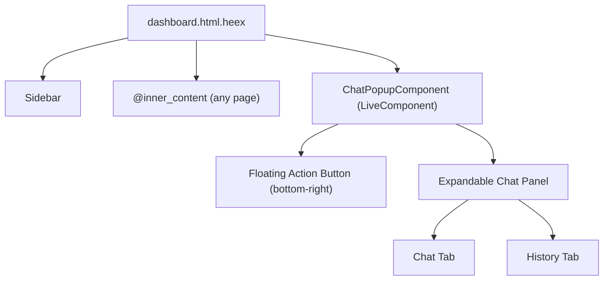

# Tailwind v4 Upgrade, Chat Popup Conversion, and UI Redesign

## Phase 1: Tailwind v4 + esbuild Upgrade

The user has already updated `mix.exs` (tailwind `~> 0.3`, esbuild `~> 0.10`) and `config/config.exs` (version `"4.1.10"`, `--input`/`--output` args, esbuild `"0.25.5"`). The remaining work is migrating the asset files.

### 1a. Migrate `assets/css/app.css`

Current (TW v3 syntax):

```css
@import "tailwindcss/base";
@import "tailwindcss/components";
@import "tailwindcss/utilities";
```

Replace with TW v4 syntax + move config from JS to CSS:

- `@import "tailwindcss";`
- `@plugin "@tailwindcss/forms";` (bundled in standalone CLI)
- `@custom-variant` for `phx-click-loading`, `phx-submit-loading`, `phx-change-loading`
- `@theme` block for all custom colors (brand, hubspot- colors from [tailwind.config.js](assets/tailwind.config.js))
- `@source` directives pointing to `"../lib/social_scribe_web"` and `"../lib/social_scribe_web.ex"` for class detection
- Heroicons plugin: extract from `tailwind.config.js` into a standalone `assets/heroicons-plugin.js` that exports a v4-compatible plugin function, and reference via `@plugin "./heroicons-plugin.js";`
- Add Inter font import and any custom utility styles for the redesign

### 1b. Create `assets/heroicons-plugin.js`

Extract the heroicons `matchComponents` plugin from the current [tailwind.config.js](assets/tailwind.config.js) (lines 54-91) into a standalone plugin file. The v4 plugin API receives `{ matchComponents, theme }` the same way -- the file should export a default function.

### 1c. Remove `assets/tailwind.config.js`

After migrating everything to CSS-native config and the heroicons plugin file, this file is no longer needed.

### 1d. Install new Tailwind + esbuild binaries

Run `mix tailwind.install` and `mix esbuild.install` to download the new versions.

---

## Phase 2: Chat UI -- Convert from Full Page to Floating Popup

The "Ask Anything" chat is currently a full-page LiveView at `/dashboard/chat` ([crm_chat_live.ex](lib/social_scribe_web/live/crm_chat_live.ex)). Per the screenshot, it should be a floating chatbot popup in the bottom-right corner, accessible from any dashboard page.

### Architecture



### 2a. Create `lib/social_scribe_web/components/chat_popup.ex`

A new **LiveComponent** that encapsulates all chat functionality:

- Floating action button (sparkles/chat icon) at bottom-right
- Expandable panel (~380px wide, ~600px tall) with slide-up animation
- Chat/History tabs (matching screenshot design)
- Message input with "Add context" pill and send button
- Manages its own state: `open`, `messages`, `conversations`, `loading`, `active_tab`
- All events handled via `phx-target={@myself}`
- Migrate the business logic from [crm_chat_live.ex](lib/social_scribe_web/live/crm_chat_live.ex) (`Chat.ask/3`, `Chat.list_conversations/1`, etc.)

Design from screenshot:

- Header: "Ask Anything" bold title + `>>` collapse button + `+` new chat button
- Tabs: "Chat" / "History" with underline active indicator
- Messages: date divider, assistant messages left-aligned, user messages in gray bubbles right-aligned
- Input area: bordered input box with placeholder "Ask anything about your meetings", send arrow button

### 2b. Embed in `dashboard.html.heex`

Add to the layout (outside the scrollable main content area):

```heex
<.live_component module={SocialScribeWeb.ChatPopup} id="chat-popup" current_user={@current_user} />
```

### 2c. Update `router.ex`

Remove or comment out `live "/chat", CrmChatLive, :index` (line 88).

### 2d. Update `sidebar.ex` / `dashboard.html.heex`

Remove the "Ask Anything" sidebar link (line 56 of dashboard layout).

### 2e. Add JS hooks for chat UX

In [hooks.js](assets/js/hooks.js), add:

- `ScrollToBottom` hook: auto-scroll chat messages div when new messages arrive
- `ChatAutoResize` hook: auto-resize textarea input as user types (optional)

---

## Phase 3: Full UI Redesign

Inspired by the clean, professional design in the screenshots (Inter font, subtle shadows, card-based layouts, smooth animations).

### Design System

- **Font**: [Inter](https://fonts.google.com/specimen/Inter) -- loaded via Google Fonts CDN in `root.html.heex`
- **Color palette**: Keep indigo as primary accent. Refine neutral grays. Add subtle gradient accents for branding.
- **Cards**: White background, `rounded-2xl`, subtle `shadow-sm` (not heavy `shadow-xl`), `border border-gray-100`
- **Spacing**: Consistent padding (p-6 for cards), generous whitespace
- **Typography**: Clear hierarchy -- page titles `text-2xl font-semibold`, section headers `text-lg font-medium`, body `text-sm`
- **Animations**: `transition-all duration-200` on interactive elements, hover effects on cards, smooth state transitions

### Files to update

**3a. [root.html.heex**](lib/social_scribe_web/components/layouts/root.html.heex)

- Add Inter font via Google Fonts `<link>` tag
- Set `font-family: 'Inter', sans-serif` on body
- Update body class for base styles

**3b. [dashboard.html.heex**](lib/social_scribe_web/components/layouts/dashboard.html.heex)

- Modernize header bar: subtle border, clean typography
- Refine sidebar width and styling
- Update main content area padding and background

**3c. [sidebar.ex**](lib/social_scribe_web/components/sidebar.ex)

- Smoother active state indicator (left border or background pill instead of bottom border)
- Hover transitions
- Better icon + label alignment
- Remove "Ask Anything" link

**3d. [core_components.ex**](lib/social_scribe_web/components/core_components.ex)

- Update modal backdrop and container styling
- Refine button styles (rounded-lg, better hover states, subtle shadows)
- Update form input styles (modern rounded borders, focus rings)
- Update flash notifications styling
- Update table styles

**3e. [home_live.html.heex**](lib/social_scribe_web/live/home_live.html.heex)

- Modernize calendar events cards (subtle shadows, cleaner toggle switch)
- Better empty/loading states

**3f. [meeting_live/index.html.heex**](lib/social_scribe_web/live/meeting_live/index.html.heex)

- Modernize meeting cards (cleaner layout, hover states, subtle animations)

**3g. [meeting_live/show.html.heex**](lib/social_scribe_web/live/meeting_live/show.html.heex)

- Refine section cards, CRM integration buttons, transcript display

**3h. [automation_live/index.html.heex**](lib/social_scribe_web/live/automation_live/index.html.heex)

- Modernize automation cards and toggle styling

**3i. [automation_live/show.html.heex**](lib/social_scribe_web/live/automation_live/show.html.heex)

- Cleaner detail layout

**3j. [user_settings_live.html.heex**](lib/social_scribe_web/live/user_settings_live.html.heex)

- Modernize settings cards, account connection buttons

**3k. [landing_live.ex**](lib/social_scribe_web/live/landing_live.ex)

- Refresh landing page with modern gradients, better CTA styling

**3l. [modal_components.ex**](lib/social_scribe_web/components/modal_components.ex)

- Already well-styled from the CRM modal work; minor refinements to match the new design system

**3m. [app.html.heex**](lib/social_scribe_web/components/layouts/app.html.heex)

- Update the non-dashboard layout for consistency
