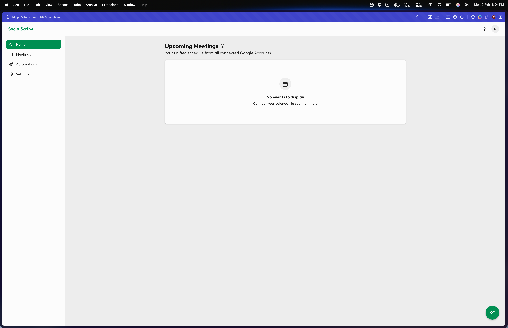
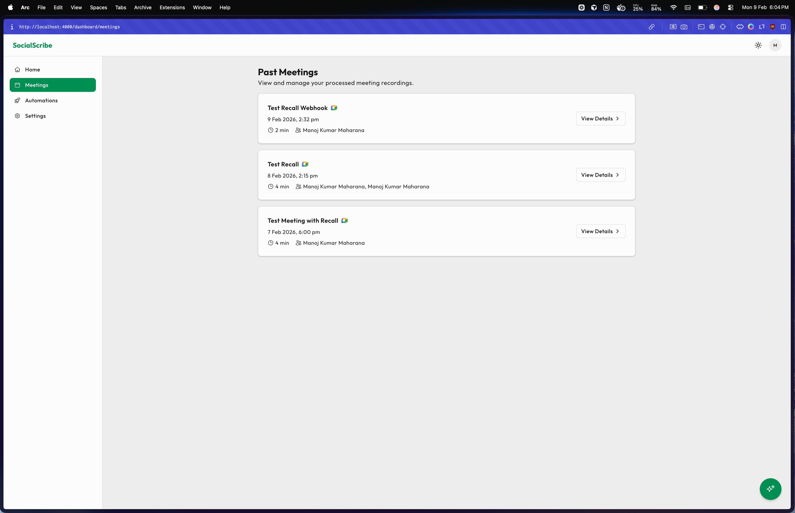
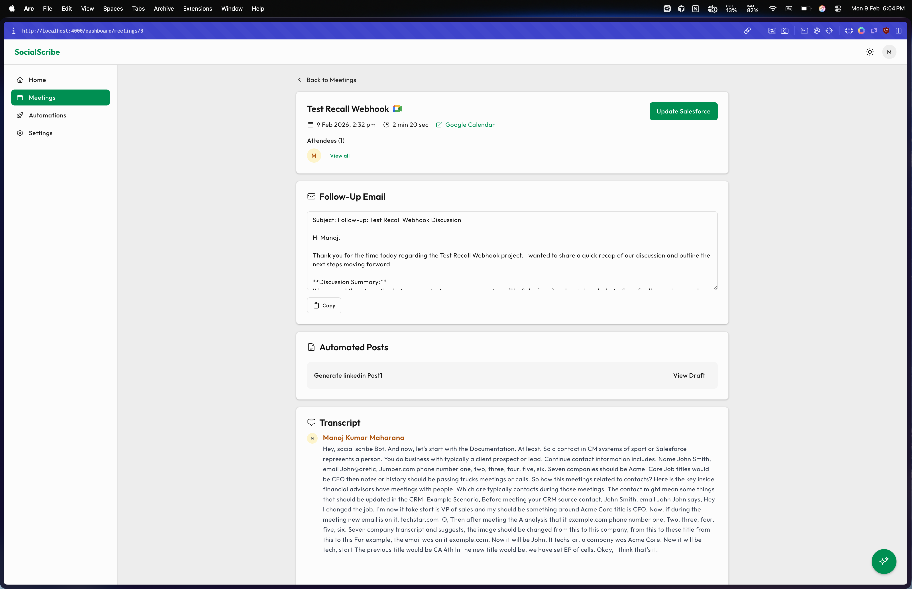
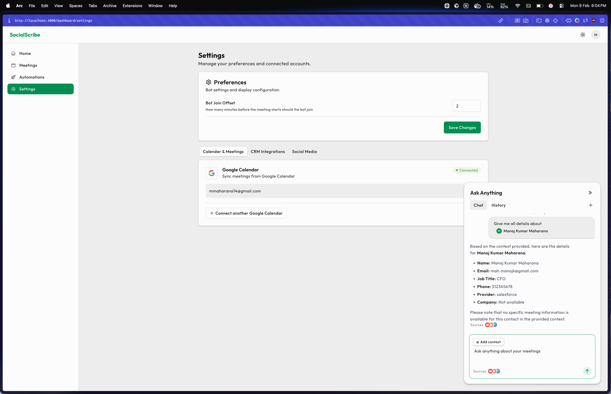
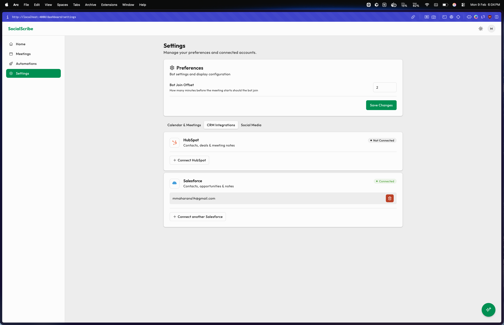

# Social Scribe 🤖📝✨

**Stop manually summarizing meetings and drafting social media posts! Social Scribe leverages AI to transform your meeting transcripts into engaging follow-up emails and platform-specific social media content, ready to share.**

Social Scribe is a powerful Elixir and Phoenix LiveView application designed to connect to your calendars, automatically send an AI notetaker to your virtual meetings, provide accurate transcriptions via Recall.ai, and then use a configurable AI provider (Anthropic Claude by default, or Google Gemini) to draft compelling follow-up emails and social media posts through user-defined automation rules. This project was developed with significant AI assistance, as encouraged by the challenge, to rapidly build a feature-rich application.

---

## 🌟 Key Features Implemented

* **Google Calendar Integration:**
  * Seamlessly log in with your Google Account.
  * Connect multiple Google accounts to aggregate events from all your calendars.
  * View your upcoming calendar events directly within the app's dashboard.
  * Configure bot join timing in settings (default: 2 minutes before meeting).
* **Automated Meeting Transcription with Recall.ai:**
  * Toggle a switch for any calendar event to have an AI notetaker attend.
  * The app intelligently parses event details (description, location) to find Zoom or Google Meet links.
  * Recall.ai bot joins meetings a configurable number of minutes before the start time.
  * **Bot ID Management:** Adheres to challenge constraints by tracking individually created `bot_id`s.
  * **Polling for Media:** Implements a robust polling mechanism (via Oban) to check bot status and retrieve transcripts/media.
* **AI-Powered Content Generation (Anthropic Claude or Google Gemini):**
  * Uses a configurable LLM (Anthropic Claude default; set `LLM_PROVIDER=gemini` for Google Gemini) to draft follow-up emails and automation content.
  * Automatically drafts a follow-up email summarizing key discussion points and action items from the meeting transcript.
  * **Custom Automations:** Users can create, view, and manage automation templates, defining custom prompts, target platforms (LinkedIn, Facebook), and descriptions.
* **CRM Integration (HubSpot & Salesforce):**
  * Connect HubSpot or Salesforce via OAuth from Settings.
  * AI analyzes meeting transcripts and suggests updates to CRM contacts.
  * Review suggestions with side-by-side comparison (old → new values).
  * Selectively apply updates to the CRM with one click.
* **CRM Chat (Ask Anything):**
  * Ask questions about your CRM contacts using natural language.
  * Use @mentions to reference specific contacts (e.g., "What is @John Smith's company?").
  * AI searches connected CRMs and provides instant answers.
  * Full conversation history with multiple chat threads.
* **Social Media Integration & Posting:**
  * Securely connect LinkedIn and Facebook accounts via OAuth on the Settings page.
  * **Direct Posting:** Generated content can be posted directly to LinkedIn or Facebook.
* **Meeting Management & Review:**
  * View past meetings with attendees, duration, platform detection (Zoom, Meet, Teams).
  * Full transcripts with speaker identification.
  * AI-generated follow-up emails and automation results.
  * **Copy & Post Buttons:** Easy content reuse and direct posting.
* **Modern Tech Stack & Background Processing:**
  * Built with Elixir & Phoenix LiveView for a real-time, interactive experience.
  * Utilizes Oban for robust background job processing.
  * Secure credential management using Ueberauth.

---

## 📸 Screenshots

### Home Dashboard


### Meetings List


### Meeting Details


### Chat Interface


### CRM Settings


### Social Media Settings


---

## 🛠 Tech Stack

* **Backend:** Elixir, Phoenix LiveView
* **Database:** PostgreSQL
* **Background Jobs:** Oban (cron jobs, queues)
* **Authentication:** Ueberauth (Google, LinkedIn, Facebook, HubSpot, Salesforce)
* **HTTP Clients:** Tesla (for CRM API integrations)
* **Meeting Transcription:** Recall.ai API
* **AI Content Generation:** Anthropic Claude (default) or Google Gemini (set `LLM_PROVIDER=gemini`)
* **Frontend:** Tailwind CSS, Heroicons, Phoenix LiveView
* **Progress Bar:** Topbar.js for page loading indication.

---

## 🚀 Getting Started

Follow these steps to get SocialScribe running on your local machine.

### Prerequisites

* Elixir
* Erlang/OTP
* PostgreSQL
* Node.js (for Tailwind CSS asset compilation)

### Setup Instructions

1. **Clone the Repository:**

    ```bash
    git clone https://github.com/mkmah/scribe.git 
    cd scribe
    ```

2. **Install Dependencies & Setup Database:**
    The `mix setup` command bundles common setup tasks.

    ```bash
    mix setup
    ```

    This will typically:
    * Install Elixir dependencies (`mix deps.get`)
    * Create your database if it doesn't exist (`mix ecto.create`)
    * Run database migrations (`mix ecto.migrate`)
    * Install Node.js dependencies for assets (`cd assets && npm install && cd ..`)

3. **Configure Environment Variables:**
    Set the environment variables listed below. For local development you can use a `.env` file or `.envrc`; see [Deployment Guide](docs/deployment.md) for production secrets.

    | Variable | Required | Description |
    |----------|----------|-------------|
    | `GOOGLE_CLIENT_ID` / `GOOGLE_CLIENT_SECRET` | Yes | Google OAuth (Google Cloud Console). Add `GOOGLE_REDIRECT_URI` for production. |
    | `RECALL_API_KEY` | Yes | Recall.ai API key ([recall.ai](https://www.recall.ai/)). Optionally `RECALL_REGION`. |
    | **Default LLM (Anthropic)** | | |
    | `ANTHROPIC_BASE_URL` / `ANTHROPIC_AUTH_TOKEN` / `ANTHROPIC_MODEL` | Yes (default) | When using default AI provider. |
    | **Alternative LLM (Gemini)** | | |
    | `GEMINI_API_KEY` | If using Gemini | Set `LLM_PROVIDER=gemini` to use Google Gemini instead of Anthropic. |
    | `HUBSPOT_CLIENT_ID` / `HUBSPOT_CLIENT_SECRET` | Optional | HubSpot OAuth (CRM). |
    | `SALESFORCE_CLIENT_ID` / `SALESFORCE_CLIENT_SECRET` | Optional | Salesforce Connected App (CRM). |
    | `LINKEDIN_CLIENT_ID` / `LINKEDIN_CLIENT_SECRET` | Optional | LinkedIn posting. |
    | `FACEBOOK_APP_ID` / `FACEBOOK_APP_SECRET` | Optional | Facebook posting. |

4. **Start the Phoenix Server:**

    ```bash
    mix phx.server
    ```

    Or, to run inside IEx (Interactive Elixir):

    ```bash
    iex -S mix phx.server
    ```

Now you can visit [`localhost:4000`](http://localhost:4000) from your browser.

### Deploy to Fly.io

The repo includes a GitHub Action that deploys to Fly.io on push to `master`. Configure the `FLY_API_TOKEN` secret in your GitHub repository. See the [Deployment Guide](docs/deployment.md) for manual deploy steps and how to set secrets on Fly.io.

---

## ⚙️ Functionality Deep Dive

* **Connect & Sync:** Users log in with Google. The "Settings" page allows connecting multiple Google accounts, plus LinkedIn and Facebook accounts. For Facebook, after initial connection, users are guided to select a Page for posting. Calendars are synced to a database to populate the dashboard with upcoming events.
* **Record & Transcribe:** On the dashboard, users toggle "Record Meeting?" for desired events. The system extracts meeting links (Zoom, Meet) and uses Recall.ai to dispatch a bot. A background poller (`BotStatusPoller`) checks for completed recordings and transcripts, saving the data to local `Meeting`, `MeetingTranscript`, and `MeetingParticipant` tables.
* **AI Content Generation:**
  * Once a meeting is processed, an `AIContentGenerationWorker` is enqueued.
  * This worker uses the configured LLM (Anthropic or Gemini) to draft a follow-up email.
  * It also processes all active "Automations" defined by the user. For each automation, it combines the meeting data with the user's `prompt_template` and calls the configured LLM to generate content (e.g., a LinkedIn post), saving it as an `AutomationResult`.
* **Social Posting:**
  * From the "Meeting Details" page, users can view AI-generated email drafts and posts from their automations.
  * "Copy" buttons are available.
  * "Post" buttons allow direct posting to LinkedIn (as the user) and the selected Facebook Page (as the Page).

---

## 🔗 CRM Integration (HubSpot & Salesforce)

### Architecture

The CRM integration uses a generic abstraction layer that works with multiple providers:

* **`SocialScribe.Crm.Behaviour`**: Common interface all CRM adapters must implement
* **`SocialScribe.Crm.Registry`**: Registers available CRM providers
* **Unified Token Refresher**: Single Oban worker (`CrmTokenRefresher`) handles token refresh for all CRMs

### HubSpot Integration

* **Custom Ueberauth Strategy:** `lib/ueberauth/strategy/hubspot.ex`
* **OAuth 2.0 Flow:** Authorization code flow with HubSpot's endpoints
* **Credential Storage:** Tokens stored with automatic refresh capability
* **Contact Operations:** Search, retrieve, and update contacts
* **AI Suggestions:** Analyzes meeting transcripts for contact updates

### Salesforce Integration

* **Custom Ueberauth Strategy:** `lib/ueberauth/strategy/salesforce.ex`
* **OAuth 2.0 Flow:** Salesforce Connected App authorization
* **Instance URL Storage:** Stores org-specific API endpoint
* **Contact Operations:** Full CRUD via Salesforce REST API
* **SOSL Search:** Searches across all contact fields
* **AI Suggestions:** Same AI-powered update suggestions as HubSpot

### CRM Modal UI

* **Generic Component:** `CrmModalComponent` works with any CRM provider
* **Contact Search:** Debounced search with avatar display
* **AI Suggestion Cards:**
  * Checkbox for selection
  * Current value (strikethrough if exists)
  * Arrow indicator
  * AI-suggested new value
  * Transcript timestamp link
* **Batch Updates:** Selectively apply multiple fields at once
* **Design Match:** UI matches the specification exactly

### CRM Chat (Ask Anything)

* **LiveView Interface:** `lib/social_scribe_web/live/crm_chat_live.ex`
* **@Mentions:** Tag contacts like `@John Smith` to reference them
* **Multi-CRM Search:** Searches across all connected CRMs
* **AI Responses:** Context-aware answers about your contacts
* **Conversation History:** Full chat history with multiple threads

---

## 📖 Documentation

### Getting Started

[Testing Guide](docs/testing-guide.md) - Comprehensive testing walkthrough  
[Deployment Guide](docs/deployment.md) - Deploy to Fly.io with step-by-step instructions

### Architecture & Design

[Architecture](docs/architecture.md) - System architecture and data model  
[System Design](docs/system-design.md) - UI component system (shadcn/ui-style)

### CRM Integration

[CRM Contacts Explained](docs/crm-contacts.md) - What contacts are and how they relate to meetings  
[CRM Meeting Assignment](docs/crm-meeting-assignment.md) - Auto-detection and manual CRM assignment flow

### Integrations

[Recall.ai Webhooks](docs/recall-webhooks.md) - Real-time bot status updates via webhooks

### Developer Guides

[Adding a New LLM Provider](docs/adding-new-llm-provider.md) - Integrate new AI providers  
[Adding a New CRM Provider](docs/adding-new-crm-provider.md) - Integrate new CRM systems

---

## 📚 Learn More (Phoenix Framework)

* Official website: <https://www.phoenixframework.org/>
* Guides: <https://hexdocs.pm/phoenix/overview.html>
* Docs: <https://hexdocs.pm/phoenix>
* Forum: <https://elixirforum.com/c/phoenix-forum>
* Source: <https://github.com/phoenixframework/phoenix>
