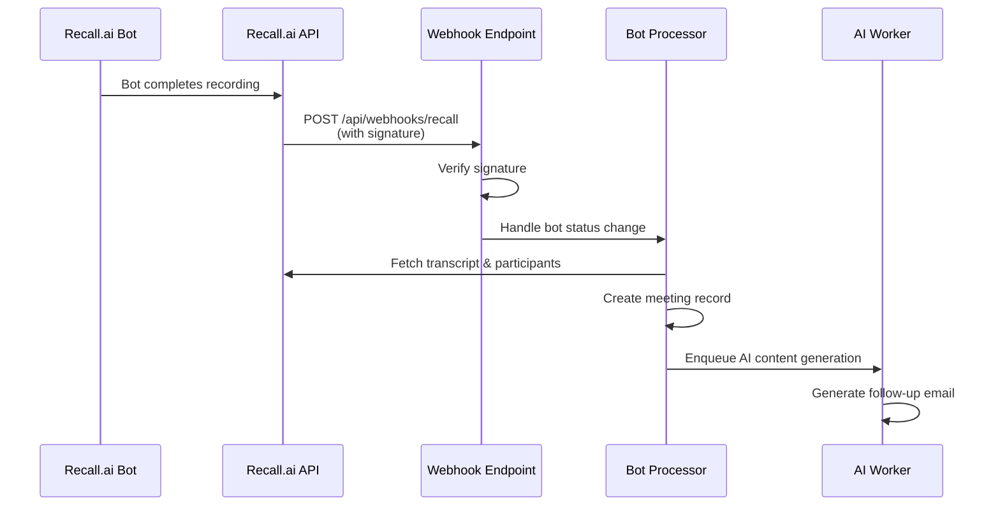

# Recall.ai Webhook Integration Guide

## Overview

This document explains how to set up and use Recall.ai webhooks for real-time bot status updates in Social Scribe. Webhooks replace the previous polling mechanism, providing instant notifications when bots complete their recording tasks.

## Table of Contents

1. [What Are Webhooks?](#what-are-webhooks)
2. [Why Use Webhooks Instead of Polling?](#why-use-webhooks-instead-of-polling)
3. [How It Works](#how-it-works)
4. [Setup Instructions](#setup-instructions)
5. [Webhook Security](#webhook-security)
6. [Webhook Payload Structure](#webhook-payload-structure)
7. [Troubleshooting](#troubleshooting)
8. [Migration from Polling](#migration-from-polling)

---

## What Are Webhooks?

Webhooks are HTTP callbacks that allow external services (like Recall.ai) to send real-time notifications to your application when specific events occur. Instead of your application repeatedly asking "Is the bot done yet?" (polling), Recall.ai proactively tells you "The bot is done!" (webhook).

### Key Concepts

- **Push vs Pull**: Webhooks are push-based (server pushes to you) vs polling which is pull-based (you pull from server)
- **Event-Driven**: Webhooks fire immediately when events occur, not on a schedule
- **Efficient**: No unnecessary API calls when nothing has changed

---

## Why Use Webhooks Instead of Polling?

### Previous Polling Approach

Before webhooks, Social Scribe used an Oban cron job (`BotStatusPoller`) that ran every 2 minutes to check the status of all pending bots:

```elixir
# Old approach: Poll every 2 minutes
{"*/2 * * * *", SocialScribe.Workers.BotStatusPoller}
```

**Problems with Polling:**

1. **Delayed Processing**: Up to 2-minute delay before detecting bot completion
2. **Rate Limiting Risk**: With many bots, polling every 2 minutes could hit API rate limits
3. **Wasted Resources**: Unnecessary API calls even when no bots have changed status
4. **Scalability Issues**: Doesn't scale well with many concurrent bots
5. **Higher Latency**: Users wait longer for meeting transcripts to be processed

### Webhook Benefits

1. **Real-Time Processing**: Instant notification when bot completes (0-1 second delay vs 0-120 seconds)
2. **No Rate Limiting**: Webhooks are push-based, so Recall.ai controls the request rate
3. **Efficient**: Only processes events when they actually occur
4. **Better Scalability**: Works efficiently with hundreds of concurrent bots
5. **Lower Latency**: Users get their meeting transcripts processed immediately
6. **Reduced Server Load**: No background polling jobs consuming resources

### Comparison Table

| Aspect | Polling (Old) | Webhooks (New) |
|--------|---------------|----------------|
| **Latency** | 0-120 seconds | 0-1 seconds |
| **API Calls** | Every 2 minutes (all bots) | Only on events |
| **Rate Limit Risk** | High (with many bots) | Low (push-based) |
| **Server Resources** | Constant polling overhead | Event-driven only |
| **Scalability** | Poor (more bots = more calls) | Excellent (linear) |
| **User Experience** | Delayed transcript processing | Instant processing |

---

## How It Works

### Architecture Overview

```
┌─────────────┐         ┌──────────────┐         ┌─────────────┐
│  Recall.ai  │────────▶│  Webhook     │────────▶│  Social     │
│   Bot       │  POST   │  Endpoint    │  Verify │  Scribe      │
│  Completes  │         │  /api/webhooks│  &      │  Processes  │
│             │         │  /recall     │  Process│  Meeting    │
└─────────────┘         └──────────────┘         └─────────────┘
```

### Flow Diagram



### Step-by-Step Process

1. **Bot Completion**: Recall.ai bot finishes recording a meeting
2. **Webhook Trigger**: Recall.ai sends HTTP POST to `/api/webhooks/recall`
3. **Signature Verification**: Our endpoint verifies the webhook signature using HMAC-SHA256
4. **Payload Parsing**: Extract bot ID, event type, and status from the payload
5. **Bot Lookup**: Find the corresponding `RecallBot` record in our database
6. **Status Update**: Update bot status in database
7. **Processing**: If status is "done", fetch transcript and participants
8. **Meeting Creation**: Create `Meeting` record with transcript data
9. **AI Generation**: Enqueue `AIContentGenerationWorker` to generate follow-up email

### Code Flow

```elixir
# 1. Webhook received
RecallWebhookController.handle(conn, params)

# 2. Verify signature
verify_webhook_signature(conn)

# 3. Parse payload
parse_webhook_payload(params)
# Returns: {:ok, bot_id, status, event_type}

# 4. Lookup bot
Bots.get_recall_bot_by_recall_id(bot_id)

# 5. Process status change
Bots.Processor.handle_bot_status_change(bot_record, status)

# 6. If done, fetch data and create meeting
Bots.Processor.process_completed_bot(bot_record, bot_api_info)
```

---

## Setup Instructions

### Prerequisites

- Recall.ai account with API access
- Social Scribe application deployed and accessible via HTTPS
- `RECALL_WEBHOOK_SECRET` environment variable configured

### Step 1: Get Your Webhook Secret

1. Log in to your [Recall.ai Dashboard](https://us-east-1.recall.ai/dashboard)
2. Navigate to **Developers** → **API Keys**
3. Find your **Workspace Verification Secret** (format: `whsec_...`)
4. Copy this secret - you'll need it for Step 3

**Note**: If your account was created before December 15, 2025, you may have separate webhook secrets per endpoint. Check the **Webhooks** tab in your dashboard.

### Step 2: Configure Environment Variable

Add the webhook secret to your environment configuration:

**Development** (`.envrc`):
```bash
export RECALL_WEBHOOK_SECRET="whsec_XfRdZzMFX864+UPVWpPNOEpwd6aqA0NfAPumEoOBOiuFFq36iNSpB43k7QYGKo5z"
```

**Production** (set in your deployment platform):
```bash
RECALL_WEBHOOK_SECRET=whsec_XfRdZzMFX864+UPVWpPNOEpwd6aqA0NfAPumEoOBOiuFFq36iNSpB43k7QYGKo5z
```

The secret is already configured in `config/runtime.exs`:
```elixir
config :social_scribe, :recall_webhook_secret, System.get_env("RECALL_WEBHOOK_SECRET")
```

### Step 3: Configure Webhook in Recall.ai Dashboard

1. Go to **Webhooks** tab in Recall.ai dashboard
2. Click **Add Webhook Endpoint** or **Edit** existing endpoint
3. Enter your webhook URL:
   ```
   https://yourdomain.com/api/webhooks/recall
   ```
   **Important**: Must use HTTPS in production
4. Select events to subscribe to:
   - **Required**: `bot.done` (triggers meeting processing)
   - **Recommended**: `bot.fatal` (for error handling)
   - **Optional**: `bot.call_ended` (for analytics/debugging)
5. Save the webhook configuration

### Step 4: Test the Webhook

Recall.ai provides a **"Svix Play"** button in the webhooks dashboard that generates a test endpoint URL. You can use this to verify your webhook is receiving events correctly.

Alternatively, trigger a test by:
1. Creating a test bot via the API
2. Waiting for it to complete
3. Checking your application logs for webhook receipt

### Step 5: Verify Setup

Check your application logs for successful webhook processing:

```
[info] Received webhook for bot 3be05ff8-87cd-4c40-8b54-ee2636abb4f3: event_type=bot.done, status=done
[info] Bot 3be05ff8-87cd-4c40-8b54-ee2636abb4f3 is done. Fetching transcript and participants...
[info] Successfully created meeting record 123 from bot 3be05ff8-87cd-4c40-8b54-ee2636abb4f3
```

---

## Webhook Security

### Signature Verification

All webhook requests are cryptographically signed using **HMAC-SHA256**. Our endpoint verifies signatures before processing any webhook payload to prevent unauthorized access.

### How Signature Verification Works

1. **Headers Received**: Recall.ai sends three headers:
   - `Webhook-Id`: Unique message identifier
   - `Webhook-Timestamp`: Unix timestamp
   - `Webhook-Signature`: Base64-encoded HMAC signature (format: `v1,<signature>`)

2. **Secret Decoding**: The webhook secret (`whsec_...`) is decoded from base64:
   ```elixir
   "whsec_" <> b64 = webhook_secret
   hmac_key = Base.decode64(b64)
   ```

3. **Signed Content**: Construct the signed content string:
   ```
   signed_content = webhook_id + "." + timestamp + "." + raw_body
   ```

4. **Signature Generation**: Compute expected signature:
   ```elixir
   expected_signature = 
     :crypto.mac(:hmac, :sha256, hmac_key, signed_content)
     |> Base.encode64()
   ```

5. **Verification**: Compare signatures using constant-time comparison:
   ```elixir
   Plug.Crypto.secure_compare(expected_signature, received_signature)
   ```

### Security Features

- **HMAC-SHA256**: Cryptographically secure signature algorithm
- **Constant-Time Comparison**: Prevents timing attacks
- **Raw Body Verification**: Uses exact raw request body (not parsed JSON)
- **401 Unauthorized**: Invalid signatures return 401, not 200

### Development Mode

If `RECALL_WEBHOOK_SECRET` is not configured, signature verification is skipped (for local development). **Always configure the secret in production.**

---

## Webhook Payload Structure

### Recall.ai Webhook Format

Recall.ai sends webhooks in the following format:

```json
{
  "event": "bot.done",
  "data": {
    "bot": {
      "id": "3be05ff8-87cd-4c40-8b54-ee2636abb4f3",
      "metadata": {}
    },
    "data": {
      "code": "done",
      "sub_code": null,
      "updated_at": "2026-02-09T08:58:13.406739+00:00"
    }
  }
}
```

### Event Types

Recall.ai sends webhooks for the following bot status events:

| Event | Description | Action Taken |
|-------|-------------|--------------|
| `bot.joining_call` | Bot connecting to call | Update status |
| `bot.in_waiting_room` | Bot in waiting room | Update status |
| `bot.in_call_not_recording` | Bot joined, not recording | Update status |
| `bot.recording_permission_allowed` | Host approved recording | Update status |
| `bot.recording_permission_denied` | Host denied recording | Update status |
| `bot.in_call_recording` | Bot actively recording | Update status |
| `bot.call_ended` | Bot left the call | Update status |
| **`bot.done`** | **Process complete** | **Fetch transcript, create meeting** |
| `bot.fatal` | Fatal error occurred | Update status to error |

### Payload Parsing

Our webhook controller extracts:

- **Bot ID**: `data.bot.id` → Used to lookup `RecallBot` record
- **Event Type**: `event` → Determines what action to take
- **Status**: `data.data.code` → Bot status code (e.g., "done", "fatal")

```elixir
defp parse_webhook_payload(params) do
  with event_type <- Map.get(params, "event"),
       data <- Map.get(params, "data"),
       bot_data <- Map.get(data, "bot"),
       bot_id <- Map.get(bot_data, "id"),
       status <- extract_status_from_event(event_type, data) do
    {:ok, bot_id, status, event_type}
  end
end
```

---

## Troubleshooting

### Webhook Not Receiving Events

**Symptoms**: No webhook logs in application, bots completing but not processed

**Solutions**:
1. Verify webhook URL is correct in Recall.ai dashboard
2. Check that webhook is enabled (not paused)
3. Ensure your application is accessible via HTTPS (required for production)
4. Check firewall/network rules allow inbound connections
5. Verify webhook secret is configured correctly

### Signature Verification Failing

**Symptoms**: `[warning] Webhook signature verification failed: :invalid_signature`

**Solutions**:
1. **Check Secret Format**: Ensure secret starts with `whsec_` and is complete
2. **Verify Environment Variable**: Confirm `RECALL_WEBHOOK_SECRET` is set correctly
3. **Check Raw Body**: Ensure `RawBodyReader` plug is working (body must be exact raw bytes)
4. **Debug Logging**: Check debug logs for expected vs received signatures
5. **Secret Decoding**: Verify secret decodes correctly (should be base64, not base64url)

**Debug Steps**:
```elixir
# Check logs for:
# - Webhook ID, Timestamp, Raw body length
# - Expected signature vs Received signature
# - HMAC key length (should be 32 bytes for SHA256)
```

### Unknown Bot ID

**Symptoms**: `[warning] Received webhook for unknown bot_id: ...`

**Solutions**:
1. Bot may have been deleted from database
2. Bot was created outside of Social Scribe
3. Database sync issue - check `recall_bots` table
4. This is normal for webhooks from other systems - returns 200 OK

### Meeting Not Created

**Symptoms**: Webhook received, bot status updated, but no meeting record

**Solutions**:
1. Check if meeting already exists (prevents duplicates)
2. Verify transcript fetch succeeded (check logs)
3. Check for errors in `Bots.Processor.process_completed_bot/2`
4. Verify `AIContentGenerationWorker` was enqueued

### Development Testing

For local development, you can:

1. **Use Svix Play**: Recall.ai dashboard provides test endpoint
2. **Tunnel with ngrok**: Expose localhost to internet
   ```bash
   ngrok http 4000
   # Use https://your-ngrok-url.ngrok.io/api/webhooks/recall
   ```
3. **Disable Verification**: Set `RECALL_WEBHOOK_SECRET=""` (development only!)

---

## Migration from Polling

### Current State

The application now uses **both** webhooks and polling:

- **Webhooks**: Primary mechanism for real-time updates
- **Polling**: Fallback safety net (runs every 30 minutes)

### Poller Configuration

The `BotStatusPoller` still runs but at reduced frequency:

```elixir
# config/config.exs
{"*/30 * * * *", SocialScribe.Workers.BotStatusPoller}  # Every 30 minutes
```

### Migration Strategy

**Phase 1: Deploy Webhooks (Current)**
- Webhooks handle real-time updates
- Poller runs every 30 minutes as backup
- Monitor webhook delivery for 1-2 weeks

**Phase 2: Verify Reliability**
- Check webhook delivery success rate
- Verify no missed bot completions
- Monitor error rates

**Phase 3: Remove Poller (Optional)**
- Once webhooks proven reliable, remove poller cron job
- Or keep as emergency fallback (recommended)

### Removing the Poller

If you want to remove polling entirely:

1. **Remove from cron config** (`config/config.exs`):
   ```elixir
   # Remove this line:
   # {"*/30 * * * *", SocialScribe.Workers.BotStatusPoller},
   ```

2. **Keep the code**: The `BotStatusPoller` module can remain for manual triggering if needed

3. **Monitor**: Watch for any missed bot completions

**Recommendation**: Keep the poller running every 30 minutes as a safety net. The overhead is minimal and provides redundancy.

---

## Code Reference

### Key Files

- **Webhook Controller**: `lib/social_scribe_web/controllers/recall_webhook_controller.ex`
- **Raw Body Reader**: `lib/social_scribe_web/plugs/raw_body_reader.ex`
- **Bot Processor**: `lib/social_scribe/bots/processor.ex`
- **Router**: `lib/social_scribe_web/router.ex` (webhook route)
- **Config**: `config/runtime.exs` (webhook secret)

### Route Definition

```elixir
# lib/social_scribe_web/router.ex
scope "/api/webhooks", SocialScribeWeb do
  pipe_through :api
  post "/recall", RecallWebhookController, :handle
end
```

### Environment Variable

```elixir
# config/runtime.exs
config :social_scribe, :recall_webhook_secret, System.get_env("RECALL_WEBHOOK_SECRET")
```

---

## Best Practices

1. **Always Use HTTPS**: Webhooks must use HTTPS in production
2. **Verify Signatures**: Never skip signature verification in production
3. **Idempotency**: Handle duplicate webhooks gracefully (check if meeting exists)
4. **Error Handling**: Return 200 OK even for unknown bots (webhook delivery succeeded)
5. **Logging**: Log all webhook events for debugging and auditing
6. **Monitoring**: Set up alerts for webhook failures
7. **Keep Fallback**: Consider keeping poller as safety net

---

## Additional Resources

- [Recall.ai Webhook Documentation](https://docs.recall.ai/docs/bot-status-change-events)
- [Svix Webhook Verification Guide](https://docs.svix.com/receiving/verifying-payloads/how-manual)
- [Recall.ai API Keys Dashboard](https://us-east-1.recall.ai/dashboard/developers/api-keys)

---

## Summary

Webhooks provide a superior alternative to polling for bot status updates:

✅ **Real-time processing** (0-1s vs 0-120s delay)  
✅ **No rate limiting concerns**  
✅ **Better scalability**  
✅ **Reduced server load**  
✅ **Improved user experience**  

The implementation includes robust security (HMAC signature verification), proper error handling, and maintains backward compatibility with the polling fallback mechanism.
